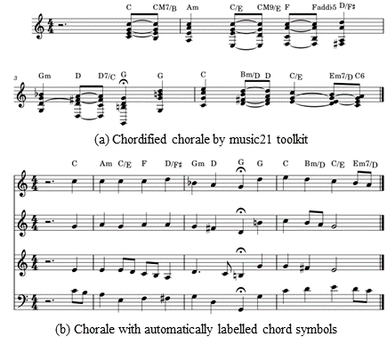

# Chordified JSB Chorales Dataset

As we did not find any full JSB Chorales dataset with human-annotated chord symbols, and as performing harmonic analysis manually is too time-consuming, we carried out the following automated preprocessing.
  
1.　**Chordifying**: simplify a complex score with multiple voices into a succession of chords in one voice (see Fig. 4a) via a tool in [music21](https://web.mit.edu/music21/doc/usersGuide/usersGuide_09_chordify.html?highlight=chordify).  
2.　**Labelling**: rank all chords based on beat strength, then only keep those with the highest scores and add them to sopranos (see Fig. 4b).

We ended up with a total of 366 chorales for training (90%) and validation (10%). Admittedly, these automatically labelled chord symbols are not authoritative from the perspective of harmonic analysis, but they are sufficient for our task.

You can find this chordified version of JSB Chorales dataset in [DeepChoir repo](https://github.com/sander-wood/deepchoir).

Figure 4: An excerpt of the processed chorale (BWV 347). The chord symbols in Fig. 4b are converted from Fig. 4a.

 
