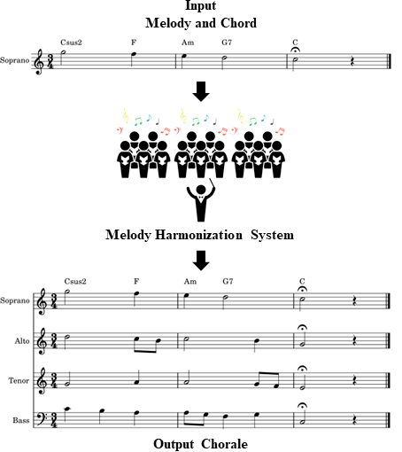

Melody harmonization has long been closely associated with chorales composed by Johann Sebastian Bach. Previous works rarely emphasised chorale generation conditioned on chord progressions, and there has been a lack of focus on assistive compositional tools. In this paper, we first designed a music representation that encoded chord symbols for chord conditioning, and then proposed DeepChoir, a melody harmonization system that can generate a four-part chorale for a given melody conditioned on a chord progression. With controllable harmonicity, users can control the extent of harmonicity for generated chorales. Experimental results reveal the effectiveness of the music representation and the controllability of DeepChoir.

 

 
Figure 1: The process of melody harmonization. Here, the alto, tenor, and bass are generated by the system.
 

Our goal is to provide an assistive compositional tool that can help users easily compose chorales. We first automatically labelled chord symbols for JSB Chorales, and encoded chords as chromagrams. We then added beat information into our music representation to make the system aware of time signatures. Furthermore, we applied [gamma sampling](https://arxiv.org/pdf/2205.06036.pdf), a sampling method for controlling language models, to achieve controllable harmonicity in the melody harmonization task, enabling users to steer the extent to which the system follows a given chord progression.

For more information, see our paper: [arXiv paper](https://arxiv.org/pdf/2202.08423.pdf) and [GitHub repo](https://github.com/sander-wood/deepchoir).
