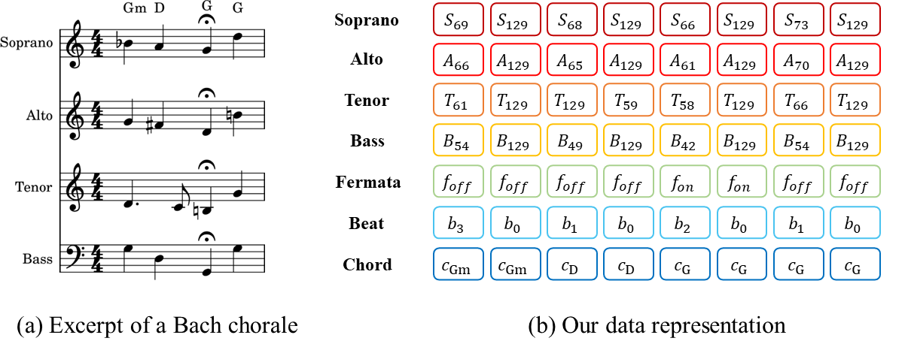
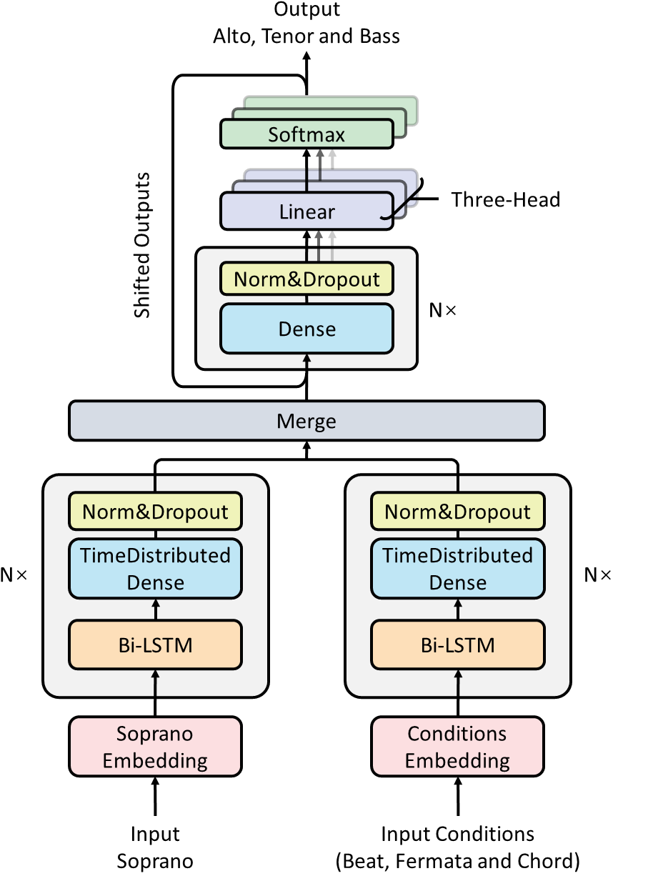

## Music Representation

As shown in Fig. 2b, our representation encodes each chorale into the following seven sequences of the same length.

 

Figure 2: For demonstration purposes, the time resolution of our proposed music representation is set to eighth notes.

 

**SATB Sequences**: encode each voice as a piano-roll consisting of 130-D one-hot vectors (128 pitches, 1 rest, and 1 hold), with a sixteenth note time resolution.

**Fermata Sequence**: consists of boolean values indicating whether a fermata symbol is present in each frame.

**Beat Sequence**: based on time signatures, encodes the beat information into 4-D one-hot vectors, which correspond to non-beat, weak, medium-weight, and strong beats (ranging from 0 to 3).

**Chord Sequence**: encodes chords as chromagrams (12-D multi-hot vectors), and each dimension corresponds to an activated pitch class of a chord.  

## DeepChoir

DeepChoir is a multi-headed autoregressive model with an encoder-decoder structure, as shown in Fig. 3. The two encoders use a stacked Bi-LSTM with a time-distributed dense layer, and the decoder uses a stacked dense layer.

 

Figure 3: The architecture of DeepChoir.

 

**Encoder**: The structure of these two encoders is identical, but their weights are not shared. The input of the soprano encoder is the embedded soprano sequence, whereas the conditions encoder one is a concatenation of embedded beat, fermata, and chord sequences. The two encoders are formed by a stack of $N=3$ identical blocks with two sub-layers. The first is a 128-hidden-size Bi-LSTM layer, and the second is a time-distributed dense layer. After the time-distributed dense layer, we use batch normalization followed by dropout with a rate of 0.2.

**Decoder**: The decoder, like the other two encoders, is composed of a stack of $N=3$ identical blocks, but it is much simpler, including only a naive stacked dense layer with batch normalization and dropout. The three-head linearly transforms and softmaxes the output of the decoder, and autoregressively generates the ATB voices frame-by-frame.

## Controllable Harmonicity

Based on the assumption that some attributes of the generated text are closely related to the occurrences of certain tokens, [gamma sampling](https://arxiv.org/pdf/2205.06036.pdf) achieves controllable text generation via scaling probabilities of attribute-related tokens during generation time:

$$p^{\mathcal{A}}_{out} &=& p_{in}^{\mathcal{A}tan(\frac{\pi \Gamma}{2})}, \\ p^{a}_{out} &=& p^{a}_{in}\cdot \frac{p^{\mathcal{A}}_{out}}{p^{\mathcal{A}}_{in}},\quad \forall a\in \mathcal{A}, \\ p^{n}_{out} &=& p^{n}_{in} \cdot (1 + \frac{p^{\mathcal{A}}_{in}-p^{\mathcal{A}}_{out}}{p^{\backslash \mathcal{A}}_{in}}),\quad \forall n\notin \mathcal{A},$$

where $\Gamma\in$[0,1] is the user-controllable parameter, $p_{in/out}$ is the input/output probability, $\mathcal{A}$ is the set of attribute-related tokens and $p^{\mathcal{A}}$ is the sum of their probabilities, while $p^{\backslash \mathcal{A}}$ is the sum of the probabilities of tokens that are not in $\mathcal{A}$. When $\Gamma=0.5$, there is \textbf{no change in the probability distribution}, while when $\Gamma<0.5$, \textbf{the probabilities of the attribute-related tokens increase} and vice versa.

Since harmonicity depends on the proportion of chord tones present in the melody (the larger the proportion, the more harmonious it is), we define chord tones as the attribute-related tokens for controllable harmonicity. To make the controllable harmonicity more intuitive, we set the harmonicity parameter $h=1-\Gamma$.
